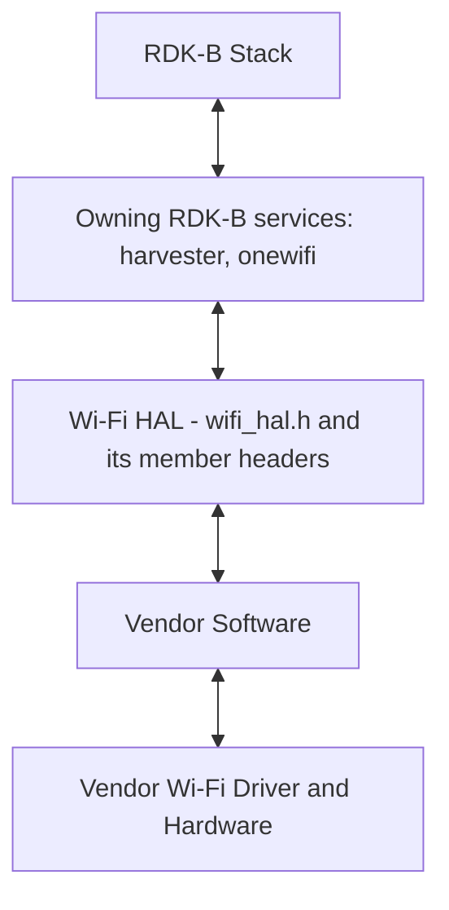
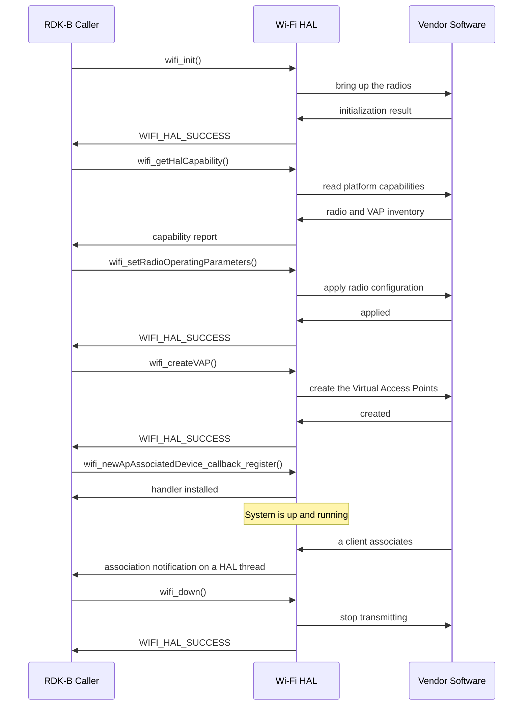

# Wifi HAL Documentation

## Version History

This table records revisions of *this document*. It is not the version of the interface, of the repository, or of the generated documentation site; those are three further identities, kept apart immediately below.

| Date | Comment | Version |
| --- | --- | --- |
| 08/16/22 | Initial Release | 0.1.0 |
| 08/24/26 | Brought to the canonical `HAL` specification topic set. Every declared `API` is now named, the four version identities are separated, and the interface's own return codes, public types and status enumerations are documented. | 0.2.0 |

Four version identities exist around this interface, and a reader who conflates them will draw the wrong conclusion about how mature it is:

- **Document revision** \- the `Version` column above. This document is at `0.2.0`.
- **Release tag** \- the nearest ancestor tag of the revision this document describes is `4.0.0`, recorded without a date in the repository's `CHANGELOG.md`. Later tags exist in the repository, including `5.0.0` and the `8.x` series, but they are not ancestors of this revision, so no later release is claimed here.
- **Interface version** \- `3.0.6`, declared by the version macros in `wifi_hal_generic.h`. This is what a caller compiles against and can test at runtime; see `Variability Management`.
- **Generated-site version string** \- `docs/generate_docs.sh` derives `PROJECT_VERSION` from `git describe --tags`, which yields a string of the form `<tag>-<commits-since-tag>-g<abbreviated-hash>`. That is a build identifier, not a released version, and it must not be read as one.

## Acronyms

- `HAL` \- Hardware Abstraction Layer, may include some common components
- `HAL.h` \- Abstracted defined API to control the hardware
- `HAL.c` \- Implementation wrapper layer created by the `OEM` or `SoC` Vendor
- `RDK` \- Reference Design Kit for All Devices
- `RDK-B` \- Reference Design Kit for Broadband Devices
- `Wi-Fi` \- Wireless Radio Networking
- `HATS` \- HAL Automated Testing System
- `OEM` \- Original Equipment Manufacturer
- `SoC` \- System on a Chip
- `ACL` \- Access Control List
- `AP` \- Access Point
- `MAC` \- Media Access Control, as in a MAC address
- `API` \- Application Programming Interface
- `BSS` \- Basic Service Set
- `BTM` \- BSS Transition Management
- `CAC` \- Channel Availability Check
- `CSI` \- Channel State Information
- `DFS` \- Dynamic Frequency Selection
- `EAP` \- Extensible Authentication Protocol
- `EAPOL` \- EAP over LAN
- `EDCA` \- Enhanced Distributed Channel Access
- `MFP` \- Management Frame Protection
- `MU` \- Multi User
- `PSK` \- Pre-Shared Key
- `RADIUS` \- Remote Authentication Dial-In User Service
- `RSSI` \- Received Signal Strength Indicator
- `SSID` \- Service Set Identifier
- `STA` \- Station, a client of an Access Point
- `TID` \- Traffic Identifier
- `TWT` \- Target Wake Time
- `U-APSD` \- Unscheduled Automatic Power Save Delivery
- `UT` \- Unit Test
- `VAP` \- Virtual Access Point
- `WMM` \- Wi-Fi Multimedia
- `WPS` \- Wi-Fi Protected Setup

## Description

The Hardware Abstraction Layer (HAL) is to abstract the RDK Wi-Fi requirements at a general level to allow platform independent control.

This repository holds the interface definition only. A vendor supplies the implementation behind it, and a caller is the RDK-B middleware that drives it. The diagram below places the interface in the stack; the workspace inventory names `harvester` and `onewifi` as the RDK-B services that own this interface, so a test or tool that drives the `HAL` directly contends with them for the hardware.



The picture below shows the relationship between the `HAL`, `Kernel` and the `WiFi Driver`, which is the layering the flowchart above abstracts into a single vendor step. It is retained because it carries detail the flowchart does not: the vendor implementation may reach the driver either through the optional `hostapd`, `nl80211` and `cfg80211` path, whose user-space and kernel halves the picture separates, or through a proprietary `IOCTL` interface. The top box in the picture is the abstracted `HAL` header, which in this repository is `wifi_hal.h`; its `hal.h` caption and vendor name are legacy labels in the asset and not the name of any file here.


## Optional Components

The following components are optional and it is up to the vendor's discretion whether to use them.

- `hostapd` (host access point daemon) is a user space daemon software enabling a network interface card to act as an access point and authentication server

- `nl80211/cfg80211` nl80211 is the interface between user space software (iw etc.) and the kernel (cfg80211 and mac80211 kernel modules, and specific drivers)

Three declared APIs presuppose the first of these and are the caller's only interface to it: `wifi_createHostApdConfig`, `wifi_startHostApd` and `wifi_stopHostApd`, with `wifi_getLibhostapd` reporting whether the implementation uses the library form and `wifi_updateLibHostApdConfig` refreshing its configuration. A vendor that reaches the driver by a proprietary route still implements those functions, because they are part of the interface; what a vendor chooses is the mechanism behind them, not their presence.

## Component Runtime Execution Requirements

It should be a statically loadable library. There should be one `HAL` interface for the system.

The lifetime of that interface shall extend throughout the lifetime of the process.

Failure to meet these requirements will likely result in undefined and unexpected behavior.

### Initialization and Startup

Initialize the Wi-Fi `HAL` using `wifi_init()` before making any other calls.

The kernel boot sequence is expected to start all the dependencies for the Wi-Fi `HAL`.

The declared functions that govern the interface's lifetime are:

- `wifi_init()` \- initializes all Wi-Fi radios and must complete successfully before any other function in the interface is invoked
- `wifi_getHalCapability()` \- reads what the platform supports, so a caller discovers the radio and `VAP` inventory before configuring anything
- `wifi_setRadioOperatingParameters()` \- applies a radio's complete operating configuration
- `wifi_createVAP()` \- creates the Virtual Access Points described by a map on one radio
- `wifi_reset()` \- resets the Wi-Fi subsystem
- `wifi_down()` \- turns off transmit power for the entire Wi-Fi subsystem
- `wifi_factoryReset()` \- performs a factory reset of the Wi-Fi subsystem
- `wifi_createInitialConfigFiles()` \- creates initial Wi-Fi configuration files
- `wifi_createHostApdConfig()`, `wifi_startHostApd()`, `wifi_stopHostApd()` \- bring up and take down the optional `hostapd` path

Third party vendors will implement these appropriately to meet operational requirements. Beyond the ordering stated here and in `Method Sequencing`, this interface does not specify a call order between the remaining functions, and a caller must not infer one from the order of declaration in a header.

### Threading Model

`HAL` is expected to be thread safe.

There is no restriction on the vendor to create any number of threads to meet the operational requirements.

**Scope of the guarantee:** the expectation is stated once here and applies across the interface, so every `API`'s inline documentation states it by reference to this topic rather than repeating a per-function rule. The obligation therefore rests with the implementation rather than with the caller: a caller may invoke the interface concurrently from more than one thread. Where a callback handler is entered, the handler itself may run on a `HAL`-owned thread, so a handler must serialize access to the caller's own state; see `Asynchronous Notification Model`.

### Process Model

A single instance is expected to exist. And only one instance will be initialized.

The interface is delivered as a statically loadable library within the calling process, so the single instance is per process and its lifetime is the process lifetime.

### Memory Model

Where `HAL` creates any memory, then `HAL` will be expected to own it.
Where `client` creates memory, then `client` is expected to own it.

Exceptions to these rules can be specified in the API documentation.

That exception clause is load-bearing rather than decorative: three declared functions use it, and each names the obligation in its own block.

#### Caller Responsibilities

- Allocate, and release, every structure and buffer passed to an `API`, including the out-parameters an `API` writes into. The `HAL` writes into a caller-supplied buffer and retains no reference to it after returning, so the caller may release it as soon as the call completes.
- Read an out-parameter only after the call has reported success. On failure the contents are unspecified, and the count fields that describe an array are unspecified with them.
- Copy any data handed to a callback before returning from the handler, unless that `API`'s documentation says otherwise.
- Release the arrays that the three documented exceptions hand back. `wifi_findNetworks()` returns a `HAL`-allocated array of `wifi_bss_info_t`; `wifi_getNeighboringWiFiStatus()` returns a `HAL`-allocated array of `wifi_neighbor_ap2_t`; and `wifi_getApAssociatedDeviceDiagnosticResult3()` ordinarily returns a `HAL`-allocated array of `wifi_associated_dev3_t`. In each case the caller passes the address of its own pointer variable, the `HAL` sets it, and the caller frees the array as a whole. This interface does not name the allocator the `HAL` used, so the matching release function is a platform convention rather than something established here.

#### Module Responsibilities

- Allocate and release the memory the implementation needs for its own operation, and release all of it when the implementation is torn down, so that nothing leaks across a `wifi_reset()` or a re-initialization.
- Where an `API` returns memory the `HAL` allocated, state that exception in that `API`'s own documentation. The three functions above are the only ones in the current surface that do so.
- Never retain a pointer to caller-supplied memory beyond the duration of the call that received it. This follows from the ownership rule above, and the declarations that take a caller-allocated structure state it explicitly.

### Power Management Requirements

There is no requirement for the component to participate in power management.

### Asynchronous Notification Model

A number of asynchronous callback registration functions exist. They carry the `_callback_register` or `_callbacks_register` suffix and are marked in the doxygen comments with the token `@execution callback`.

As a few examples of this are:-

- For asynchronous management frames transmission - `wifi_mgmt_frame_callbacks_register()`
- For asynchronous notification on client connection - `wifi_newApAssociatedDevice_callback_register()`
- For asynchronous notification on client deauthentication - `wifi_apDeAuthEvent_callback_register()`
- For asynchronous notification on client disassociation - `wifi_apDisassociatedDevice_callback_register()`
- For asynchronous notification on client connection status - `wifi_staConnectionStatus_callback_register()`
- For asynchronous notification on client scan results - `wifi_scanResults_callback_register()`

Seventeen such registration functions are declared, and five further functions install or remove a handler without carrying that suffix: `wifi_steering_eventRegister()` and `wifi_steering_eventUnregister()`, `wifi_RMBeaconRequestCallbackRegister()` and `wifi_RMBeaconRequestCallbackUnregister()`, alongside `wifi_hal_register_frame_hook()`. `API Surface` lists all of them, and `Data Structures and Defines` pairs each handler typedef with the function that installs it.

During callbacks the client is responsible for creating a copy of the data, unless otherwise specified in the API documentation.

**Handler obligations:** a handler may be entered on a `HAL`-owned thread, so it must serialize its own access to caller state. It must not suspend and must not invoke a blocking system call, for the reason given under `Blocking calls`; a slow handler delays the `HAL`, and where the notification is part of an exchange with a station it delays the response on the air. Registration is the caller's declaration of interest, so register before the events of interest are wanted, and expect no notification for anything that occurred before registration.

### Blocking calls

None of the calls in the interface should block.

**Non-Blocking Requirement:** an implementation must not suspend and must not invoke a blocking system call from any function in this interface, including from a callback handler. Where an operation cannot be completed immediately, the correct behavior is to report the condition through the return value rather than to wait.

**Timeout Handling:** this interface specifies no timeout value for any call, so a caller must not derive one from this specification. Where a caller needs a bound it is a property of that caller's own design.

### Internal Error Handling

All the APIs define a list of return codes, each API must be capable of returning all of the codes defined, the `UT` if possible, will create cases
for the error codes to be exercised.

HAL is responsible to handle system errors (e.g., failure of memory allocation, array boundary out of memory, return code check), and returning
only the fixed returned codes as defined in the `API` specification.

The fixed codes are declared in `wifi_hal_generic.h`:

| Code | Value | What it reports, and what a caller does about it |
| --- | --- | --- |
| `WIFI_HAL_SUCCESS` | `0` | The operation completed. Out-parameters may be read. |
| `WIFI_HAL_ERROR` | `-1` | The operation failed. Each `API`'s own documentation states the conditions it uses this code for, which for most of the surface include an out-of-range index, a `NULL` output pointer, and a vendor layer that could not supply the value. |
| `WIFI_HAL_INTERNAL_ERROR` | `-2` | The implementation failed internally. The caller's arguments were not the cause, so retrying the identical call is unlikely to help. |
| `WIFI_HAL_UNSUPPORTED` | `-3` | The platform does not implement the operation. This is a capability answer, not a fault: a caller should treat the feature as absent and not retry. |
| `WIFI_HAL_INVALID_ARGUMENTS` | `-4` | An argument was unacceptable, for instance an index outside the declared range or a `NULL` pointer. The caller should correct the call. |
| `WIFI_HAL_INVALID_VALUE` | `-5` | An argument was well formed but its value is not one this interface accepts for that parameter. |
| `WIFI_HAL_NOT_READY` | `-6` | The subsystem is not yet able to serve the request, for instance before `wifi_init()` has completed. A caller may retry once the pre-condition holds. |

Two aliases, `RETURN_OK` and `RETURN_ERR`, are declared in the same header with the values `0` and `-1`. They are numerically identical to `WIFI_HAL_SUCCESS` and `WIFI_HAL_ERROR`, and both are guarded so that a caller which already defines them keeps its own definition. The two vocabularies are mixed across the interface - `wifi_hal_sta.h`, for instance, documents its returns entirely in the alias spelling - so a caller comparing against a literal `0` or `-1` is correct either way, and a caller comparing symbolically should not assume one spelling.

Which codes a given function can actually return is a per-function fact, stated in that function's own `@retval` list. This topic fixes the vocabulary; it does not claim that every function returns every code.

### Persistence Model

Wi-Fi `HAL` configuration will be maintained by the upper layer.

Consequently this interface does not state, for any setting it can change, whether the change survives a reboot: several functions say as much in their own documentation and refer back to this topic. A caller that needs a setting to persist must arrange that itself. The interface declares one path constant, `RESTORE_CNFG_FILE_NAME`, but names no function that reads or writes it, so nothing here establishes which component owns that file.

## Non functional requirements

Following non-functional requirement should be supported by the component.

### Logging and debugging requirements

The component should log all the error and critical informative messages.
This helps to debug/triage the issues and understand the functional flow of the system.

The logging should be consistent across all `HAL` components. Logging should be implemented using the syslog method; the use of `printf` is discouraged unless `syslog` is not available.

If the vendor is going to log then it has to be logged in `wifi_vendor_hal.log` file name. This specification names the file and not its directory, so the log location is not established here and a caller must not depend on a particular path.

Logging should be defined with log levels as per Linux standard logging, listed here in descending order of severity:

- **FATAL:** Critical conditions, typically indicating system crashes or severe failures that require immediate attention.
- **ERROR:** Non-fatal error conditions that nonetheless significantly impede normal operation.
- **WARNING:** Potentially harmful situations that do not yet represent errors.
- **NOTICE:** Important but not error-level events.
- **INFO:** General informational messages that highlight system operations.
- **DEBUG:** Detailed information typically useful only when diagnosing problems.
- **TRACE:** Very fine-grained logging to trace the internal flow of the system.

Each log entry should include a timestamp, the log level, and a message describing the event or condition, so that log files can be parsed and compared across vendors and components.

One declared function is a logging interface in its own right rather than a diagnostic aid: `wifi_hal_analytics_callback_register()` installs the caller's log sink for catastrophic `HAL` failures, which lets the calling middleware receive those events instead of only finding them in the vendor log.

### Memory and performance requirements

During idle and Standby, memory and CPU utilization will be a minimal footprint.

Refer to product specification for guidance on maximum CPU load average and memory requirements. No numeric memory footprint limit, CPU load average or completion time is specified by this interface, so none may be inferred from this document; the figures are a property of the product a vendor is delivering against.

**Client Module Responsibility:** the caller allocates and releases the data structures the interface's functions require, including the buffers that receive data from the `HAL`, as `Memory Model` sets out.

**Vendor Implementation Responsibility:** an implementation may allocate memory internally for its own needs and is solely responsible for releasing it.

### Quality Control

The vendor should endeavour to:-

- Run a static analysis tool like Coverity etc
- Have a zero-warning policy with regards to compiling. All warnings should be enabled by default in the makefiles.
- Use of memory analysis tools like Valgrind are encouraged, to identify leaks/corruptions.
- `HAL` Tests, run under `HATS`, will endeavour to create worst case scenarios to assist investigations

**Keeping this document true:** every topic here names the file its content was derived from - a header for an interface fact, `CHANGELOG.md` and the repository's tags for `Version History`, `docs/generate_docs.sh` for the generated-site version string. Any change to one of those files obliges a review of the topics that cite it. That makes staleness detectable from a diff rather than from a review-by date, and in particular renaming or removing a declared function invalidates `API Surface` and the `Sequence Diagram` immediately.

**Who reviews it:** `CONTRIBUTING.md` gives the route - raise an issue, then open a pull request at `https://github.com/rdkcentral/rdkb-halif-wifi/compare`, which the repository's maintainers review before merging. This repository carries no `CODEOWNERS` entry and names no maintainer team, so there is no more specific addressee to record than that route.

### Licensing

 Licensed under the Apache License, Version 2.0 (the "License").
 you may not use this file except in compliance with the License.

The full text is in `LICENSE`, with attribution in `NOTICE` and the copyright statement in `COPYING`; all three are linked into `docs/pages/` so the generated documentation carries them. An implementation of this interface is expected to be released under the same license.

### Build Requirements

The source code should be built under a Linux environment using `make`, `gcc` and the associated tooling as required, and would normally be delivered as a library and source code. That is the expectation placed on the vendor implementation.

What this repository itself declares is narrower, and a caller should not read more into it than is there. Alongside the headers it tracks one build manifest, `configure.ac`, which is an Autoconf manifest rather than a `cmake` project: it requires Autoconf `2.65` or later, initialises a component named `hal` at version `1.0`, and enables Automake and Libtool with shared libraries enabled and static disabled. It does **not** amount to a working build of anything. The manifest expects an Automake input file that this repository does not track, and it names no library and no installed artefact, so **no library name and no build output is specified by this repository**. The one other build script here, `build_ut.sh`, builds the unit-test suite by cloning a companion test repository derived from this one's remote; it does not build the interface.

The practical consequence is that the library a caller links against, and the toolchain that produced it, are properties of the product being built and must be taken from there rather than from this specification.

To use the interface:

1. **Inclusion:** include `wifi_hal.h`. It is an umbrella header that declares nothing itself and includes the seven per-area headers listed in `API Surface`, so one include obtains the whole current surface. It also includes `wifi_hal_deprecated.h`; see the scope note at the end of `API Surface`.
2. **Linking:** establish a linker dependency on the vendor-supplied implementation. This repository does not name that library, so the name comes from the platform.

### Variability Management

Ideally the source code should be delivered into git repositories and tagged based on the requirements for the project.

The role of adjusting the interface, guided by versioning, rests with architecture. Vendors then align their implementation with a designated version of the interface. Each `API` interface is versioned using [Semantic Versioning 2.0.0](https://semver.org/), and the vendor code complies with a specific version of it.

**The interface version a caller compiles against is `3.0.6`**, and it is declared twice over in `wifi_hal_generic.h`: by the macros `WIFI_HAL_MAJOR_VERSION` `3`, `WIFI_HAL_MINOR_VERSION` `0` and `WIFI_HAL_MAINTENANCE_VERSION` `6`, which `WIFI_HAL_VERSION` composes into a single comparable integer as `major * 1000 + minor * 10 + maintenance`; and by that header's own interface changelog, which records what changed for `3.0.6` and for each of `3.0.5` down to `3.0.1`, continuing the `2.2.0` to `3.0.0` history kept in `wifi_hal.h`. A caller can therefore test the interface version it compiled against at build time, and the value is independent of the repository's release tag and of this document's revision - see `Version History`.

Compile time flags can control compilation. `config` flags are encouraged, so this can be defined at the top-level compile time, in the shape:

```c
#ifdef CONFIG_WIFI_V6
 .. do wifi v6
#else
.. no v6
#endif
```

That is the pattern, illustrated with a name of the caller's own choosing: `CONFIG_WIFI_V6` is not defined or referenced anywhere in this interface. The flags this interface really is conditioned on are named in `Platform or Product Customization`.

The interface will maintain `wifi_getHalCapability()` functionality, and the upper layers will use this to determine available features. That is the runtime counterpart to the compile-time flags: a caller reads the platform's actual capabilities rather than inferring them.

### Platform or Product Customization

Two compile-time flags condition this interface, and both are visible to a caller rather than internal to an implementation. Neither is defined by this repository; both are supplied by the build.

**When `WIFI_HAL_VERSION_3_PHASE2` is defined:**

- **Twelve functions are declared by the documented headers only in this configuration.** In `wifi_hal_ap.h`: `wifi_getApAssociatedDevice`, `wifi_kickApAssociatedDevice`, `wifi_getApAclDevices`, `wifi_addApAclDevice` and `wifi_delApAclDevice` - so the per-address `ACL` write path and the associated-device enumeration are conditional, while `wifi_delApAclDevices` and `wifi_getApAclDeviceNum` beside them are not. In `wifi_hal_radio.h`: `wifi_getRadioChannelsInUse`. In `wifi_hal_extender.h`: `wifi_steering_setGroup`, `wifi_setBTMRequest`, `wifi_setRMBeaconRequest` and `wifi_getRMCapabilities`. In `wifi_hal_telemetry.h`: `wifi_getNeighboringWiFiStatus` and `wifi_getApAssociatedClientDiagnosticResult`.

  Those twelve names do not simply vanish in the other configuration. `wifi_hal_deprecated.h` declares each of them behind the complementary `#ifndef` guard, so exactly one declaration of each name is compiled either way, and the two headers are complementary rather than duplicating. What changes with the flag is therefore *which header owns the declaration*, and only the form declared here is part of the documented contract - see the scope note at the end of `API Surface`. A caller that needs the same source to build both ways must guard its use of these twelve accordingly.
- **Two structures change a member's type.** `wifi_radius_settings_t` types `ip`, `s_ip` and `connectedendpoint` as `ip_addr_t` rather than `unsigned char[45]`, so a caller that assembles a `RADIUS` address as text does not port between configurations. `wifi_apRssi_t` types `ap_channelWidth` as the enumeration `wifi_channelBandwidth_t` rather than a plain `UINT`, which is the difference between a value the compiler checks and one it does not.
- **One structure is declared twice.** `wifi_steering_evConnect_t` has a separate definition in each arm.
- **Five handler typedefs change signature.** `wifi_newApAssociatedDevice_callback`, `wifi_receivedMgmtFrame_callback` and `wifi_receivedDataFrame_callback` in `wifi_hal_ap.h`, and the `peerMac` argument of `wifi_BTMQueryRequest_callback` and `wifi_BTMResponse_callback` in `wifi_hal_extender.h`, which is a `mac_address_t` of six raw octets here and a `CHAR *` otherwise. A handler written against one form does not compile against the other.

**When `WIFI_HAL_VERSION_3` is defined:**

- `MAX_NUM_RADIOS` is `3` rather than `2`, which changes the upper bound on every radio index a caller may pass.
- `wifi_vap_security_t` carries `mfp` as the enumeration `wifi_mfp_cfg_t` rather than the character array `mfpConfig`.

Nothing else in this interface is conditioned on a compile-time flag. Where a caller needs to know what a running platform supports rather than what its build configured, `wifi_getHalCapability()` is the mechanism, not a flag test.

## Interface API Documentation

The interface is documented by Doxygen and will be included with this release.

The division of labour is deliberate. This document carries the narrative contract - what the interface is, what order to call it in, who owns which memory, what a return code means. The per-`API` contract - every parameter's direction, range and ownership, every pre-condition and post-condition, every return value and its cause, and whether a call may block - lives in the inline Doxygen on each declaration, in the headers listed under `API Surface`. Because that per-`API` detail is carried by the headers, there is no separate detailed reference document for this `HAL`. The generated documentation collects the declarations under two groups defined in `wifi_hal.h`: `WIFI_HAL_TYPES` for the structures, enumerations, typedefs and constants a caller populates or interprets, and `WIFI_HAL_APIS` for the callable functions.

### Theory of operation and key concepts

The interface presents the Wi-Fi subsystem as three kinds of addressable thing, and almost every function names one of them. A **radio** is a physical transmitter, identified by an index from `RADIO_INDEX_1` up to `MAX_NUM_RADIOS`. A **Virtual Access Point** is a broadcasting service hosted on a radio, identified by an `AP` index from `AP_INDEX_1` to `AP_INDEX_24`, with `MAX_NUM_VAP_PER_RADIO` bounding how many one radio carries. A **station** is a client, identified by its MAC address, and is either associated with one of this device's `VAP`s or - when the device itself acts as a client, through `wifi_hal_sta.h` - associated with somebody else's.

Which of those indices a platform actually provisions is a platform fact, not an interface fact: the interface declares the constants and `wifi_getHalCapability()` reports what exists.

#### Object Lifecycles

- **Creation.** The `HAL` is not an object factory. The caller allocates the structures it passes and the structures it reads, the implementation populates them, and the caller releases them. The only exceptions are the three functions named under `Memory Model` that hand back a `HAL`-allocated array.
- **Configuration objects.** A radio's configuration travels as a `wifi_radio_operationParam_t` and a radio's set of `VAP`s as a `wifi_vap_info_map_t` of `wifi_vap_info_t` entries. `wifi_createVAP()` applies such a map and `wifi_getRadioVapInfoMap()` reads it back, so the map is the unit in which `VAP` configuration is created and inspected. `wifi_deleteAp()` removes a single Access Point and releases the state held for it.
- **Destruction.** Releasing a structure the caller allocated is the caller's business, and the `HAL` holds no reference to it after the call that used it. Tearing down the subsystem is `wifi_down()`, `wifi_reset()` or `wifi_factoryReset()`, after which the initialization pre-condition applies again.
- **Identifiers.** A radio index, an `AP` index and a station MAC address are the only identifiers this interface uses to name instances. There is no opaque handle to keep.

#### Method Sequencing

- `wifi_init()` first. Every other function in the interface requires it to have completed successfully, and a call made beforehand fails rather than blocking.
- Discover before configuring: `wifi_getHalCapability()` reports the radio and `VAP` inventory and the platform's supported modes, which is what tells a caller which indices and which values the calls below will accept.
- Configure the radio before the `VAP`s that sit on it: `wifi_setRadioOperatingParameters()` establishes a radio's channel, bandwidth and standard, and `wifi_createVAP()` then creates the Virtual Access Points hosted on it. `wifi_getRadioOperatingParameters()` and `wifi_getRadioVapInfoMap()` read either back.
- Register handlers before the events wanted. A registration function installs a handler for events from that moment on; nothing replays what happened earlier.
- Tear down with `wifi_down()`, `wifi_reset()` or `wifi_factoryReset()` as the situation requires, and re-initialize before using the interface again.

Beyond these orderings, and the per-function pre-conditions each declaration states, this interface does not specify a call order. Two functions that both operate on the same radio may be called in either order unless one of them says otherwise, and a caller must not read an ordering out of the sequence in which declarations appear in a header.

#### State-Dependent Behavior

- **Before initialization.** Every function may report `WIFI_HAL_NOT_READY` or fail until `wifi_init()` has completed. This is the one state distinction the interface makes uniformly.
- **Radio and `VAP` enable state.** A radio that is administratively disabled takes every Access Point hosted on it off the air, so a read against a `VAP` on a disabled radio reports the state it is in rather than the configuration it would have. `wifi_getRadioStatus()` reports operational state and `wifi_getRadioEnable()` administrative state; the two are not the same question, and a radio can be enabled and not yet up.
- **`DFS` occupancy.** A channel that is subject to `DFS` may be unusable while a `Channel Availability Check` or a `Non-Occupancy Period` is outstanding, which is why a channel set can be refused on hardware that supports it.
- **Statistics and diagnostics.** The counters a statistics call returns depend on what the subsystem has done since it started, and several of them are cumulative rather than instantaneous, so a caller measuring a rate differences two samples itself.

What this interface does **not** establish is the set of legal transitions between the states it reports. It declares status enumerations, not a state machine; see `State Diagram`.

### Data Structures and Defines

A caller of this interface constructs or interprets the types below. Every one is declared under the `WIFI_HAL_TYPES` group, and the complete field-level documentation is on the declaration itself - the tables here name each type, say where it is declared and what it represents, and leave the members to the header.

**Status codes and their aliases** \- `wifi_hal_generic.h`. `WIFI_HAL_SUCCESS`, `WIFI_HAL_ERROR`, `WIFI_HAL_INTERNAL_ERROR`, `WIFI_HAL_UNSUPPORTED`, `WIFI_HAL_INVALID_ARGUMENTS`, `WIFI_HAL_INVALID_VALUE` and `WIFI_HAL_NOT_READY`, with the aliases `RETURN_OK` and `RETURN_ERR`. Values and meanings are tabulated under `Internal Error Handling`.

**Index and limit constants** \- `wifi_hal_generic.h`.

| Constant | Represents |
| --- | --- |
| `RADIO_INDEX_1`, `RADIO_INDEX_2`, `RADIO_INDEX_3` | The radio indices this interface names. |
| `MAX_NUM_RADIOS` | The upper bound on radio indices; `3` under `WIFI_HAL_VERSION_3`, otherwise `2`. |
| `AP_INDEX_1` to `AP_INDEX_24` | The Access Point indices this interface names. Which of them a platform provisions is not established here. |
| `MAX_NUM_VAP_PER_RADIO` | How many Virtual Access Points one radio carries; `8`. |
| `MAC_STR_LEN`, `ETHER_ADDR_LEN` | The length of a printable MAC address string, and of a MAC address in raw octets. |
| `ACL_MACADDR_SIZE`, `ACL_MACFLT_NUM`, `MAC_LIST_SIZE`, `ACL_MAC_ARRAY_MAX`, `ASSOC_MAC_ARRAY_MAX` | The sizes that bound the `ACL` and associated-device arrays a caller passes. |
| `MAX_NUM_TWT_SESSION`, `MAX_STA_PER_SESSION` | The bounds on `TWT` session and per-session station counts. |
| `WIFI_HAL_MAJOR_VERSION`, `WIFI_HAL_MINOR_VERSION`, `WIFI_HAL_MAINTENANCE_VERSION`, `WIFI_HAL_VERSION` | The interface version a caller compiled against; see `Variability Management`. |
| `RESTORE_CNFG_FILE_NAME`, `NVRAM_LINE_MAX` | A restore-configuration file name and line bound. No function in this interface reads or writes it; see `Persistence Model`. |
| `CONN_NEW`, `CONN_RENEW`, `CONN_RECONN_AFTER_INACTIVITY` | The three client-connection event modes a client-association notification distinguishes. |

**Every type a declared signature takes or returns.** The list is complete: it is derived from the signatures themselves, so a type appears here if and only if some declared function names it in a return type or a parameter type. The `Represents` column carries the opening statement of that type's own documentation, and the member-level detail stays on the declaration.

| Type | Declared in | Represents |
| --- | --- | --- |
| `mac_address_t` | `wifi_hal_generic.h` | MAC address type. |
| `wifi_80211ax_params_t` | `wifi_hal_generic.h` | 802.11ax parameters. |
| `wifi_BTMRequest_t` | `wifi_hal_extender.h` | BSS Transition Management Request Frame. |
| `wifi_BeaconRequest_t` | `wifi_hal_extender.h` | Beacon Request. |
| `wifi_FastTransitionConfig_t` | `wifi_hal_client_mgt.h` | A complete 802.11r Fast BSS Transition configuration for one Access Point. |
| `wifi_GASConfiguration_t` | `wifi_hal_ap.h` | GAS configuration structure. |
| `wifi_InterworkingElement_t` | `wifi_hal_ap.h` | Interworking Element structure. |
| `wifi_VAPTelemetry_t` | `wifi_hal_telemetry.h` | VAP telemetry information. |
| `wifi_access_category_t` | `wifi_hal_generic.h` | Wi-Fi access category (AC) type. |
| `wifi_ap_capabilities_t` | `wifi_hal_ap.h` | Wi-Fi AP capabilities. |
| `wifi_associated_dev3_t` | `wifi_hal_generic.h` | Information about an associated device. |
| `wifi_associated_dev_rate_info_rx_stats_t` | `wifi_hal_extender.h` | RX statistics for a specific rate. |
| `wifi_associated_dev_rate_info_tx_stats_t` | `wifi_hal_extender.h` | TX statistics for a specific rate. |
| `wifi_associated_dev_stats_t` | `wifi_hal_extender.h` | Associated device statistics. |
| `wifi_associated_dev_tid_stats_t` | `wifi_hal_extender.h` | TID statistics. |
| `wifi_bss_info_t` | `wifi_hal_generic.h` | BSS information. |
| `wifi_channelStats_t` | `wifi_hal_extender.h` | Wi-Fi channel statistics. |
| `wifi_channel_t` | `wifi_hal_generic.h` | Wi-Fi channel information. |
| `wifi_channels_list_t` | `wifi_hal_generic.h` | Channel list. |
| `wifi_data_priority_t` | `wifi_hal_ap.h` | Wi-Fi data priority values. |
| `wifi_disconnectType_t` | `wifi_hal_extender.h` | Wifi Disconnect Types These are the types of wifi disconnects. |
| `wifi_dl_data_ack_type_t` | `wifi_hal_radio.h` | Downlink data acknowledgement types. |
| `wifi_dl_mu_type_t` | `wifi_hal_generic.h` | Wi-Fi downlink MU types. |
| `wifi_eap_config_t` | `wifi_hal_client_mgt.h` | The EAP and EAPOL timing parameters an Access Point uses during 802.1X authentication. |
| `wifi_edca_t` | `wifi_hal_radio.h` | Enhanced Distributed Channel Access (EDCA) parameters. |
| `wifi_guard_interval_t` | `wifi_hal_radio.h` | Selects the OFDM guard interval a radio transmits with. |
| `wifi_hal_capability_t` | `wifi_hal_generic.h` | Wi-Fi HAL capabilities. |
| `wifi_key_multi_psk_t` | `wifi_hal_ap.h` | Structure for storing multi-PSK keys. |
| `wifi_na_sta_info_t` | `wifi_hal_telemetry.h` | Returned unassociated station link metrics. |
| `wifi_na_sta_req_params_t` | `wifi_hal_telemetry.h` | Parameters to request unassociated station information. |
| `wifi_neighborScanMode_t` | `wifi_hal_ap.h` | Represents the Wi-Fi scan modes. |
| `wifi_neighbor_ap2_t` | `wifi_hal_telemetry.h` | Neighboring Access Point information. |
| `wifi_radioTemperature_t` | `wifi_hal_radio.h` | Radio temperature information. |
| `wifi_radioTrafficStats2_t` | `wifi_hal_telemetry.h` | Wi-Fi radio traffic statistics. |
| `wifi_radio_index_t` | `wifi_hal_generic.h` | Wi-Fi radio index type. |
| `wifi_radio_operationParam_t` | `wifi_hal_radio.h` | Wi-Fi radio operation parameters. |
| `wifi_radius_setting_t` | `wifi_hal_ap.h` | RADIUS Server information. |
| `wifi_roamingConsortiumElement_t` | `wifi_hal_ap.h` | Roaming consortium element. |
| `wifi_ssidTrafficStats2_t` | `wifi_hal_telemetry.h` | Wi-Fi SSID traffic statistics. |
| `wifi_sta_capability_t` | `wifi_hal_sta.h` | Station capabilities. |
| `wifi_station_stats_t` | `wifi_hal_sta.h` | Station statistics. |
| `wifi_steering_apConfig_t` | `wifi_hal_extender.h` | Steering configuration per AP. |
| `wifi_steering_clientConfig_t` | `wifi_hal_extender.h` | Configuration per Client This defines the per-client, per-apIndex configuration settings. |
| `wifi_trafficStats_t` | `wifi_hal_ap.h` | Wi-Fi traffic statistics. |
| `wifi_twt_params_t` | `wifi_hal_generic.h` | Wi-Fi TWT parameters. |
| `wifi_twt_sessions_t` | `wifi_hal_generic.h` | Wi-Fi TWT sessions. |
| `wifi_ul_mu_type_t` | `wifi_hal_generic.h` | This interface declares the type but states no description for it. |
| `wifi_vap_info_map_t` | `wifi_hal_ap.h` | VAP information map structure. |
| `wifi_vap_info_t` | `wifi_hal_ap.h` | VAP information structure. |
| `wifi_vap_security_t` | `wifi_hal_ap.h` | VAP security settings. |
| `wifi_wps_t` | `wifi_hal_ap.h` | Wi-Fi Protected Setup (WPS) settings. |

Further types a caller interprets *inside* those structures, rather than passing directly: `wifi_platform_property_t` and `wifi_interface_name_idex_map_t` in `wifi_hal_generic.h`, which carry the platform properties and the index-to-interface-name mapping inside the capability report; `wifi_channelBandwidth_t` and `ip_addr_t` in the same header, which are the channel-width codes and the address form the `RADIUS` settings use under `WIFI_HAL_VERSION_3_PHASE2`; `wifi_security_key_t`, `wifi_mfp_cfg_t` and `wifi_radius_settings_t` in `wifi_hal_ap.h`, which are the key material, the management-frame-protection setting and the `RADIUS` server settings inside a `VAP`'s security configuration - and note that `wifi_radius_settings_t` is a different type from the signature-facing `wifi_radius_setting_t` in the table above, differing by one letter, with the plural form being the one whose address members are flag-conditional; `wifi_apRssi_t` in `wifi_hal_telemetry.h`, whose `ap_channelWidth` member is flag-conditional; and `wifi_steering_evConnect_t` and `wifi_steering_evProbeReq_t` in `wifi_hal_extender.h`, which are the client-steering events a steering handler receives. The complete type inventory is the `WIFI_HAL_TYPES` group of the generated documentation, collected from the twenty-three group spans the seven headers contribute.

**Handler typedefs, and the function that installs each.** A typedef in this group is a function-pointer type the caller implements; the registration function beside it is how the implementation is told about it.

| Handler typedef | Installed by |
| --- | --- |
| `wifi_newApAssociatedDevice_callback` | `wifi_newApAssociatedDevice_callback_register` |
| `wifi_apDisassociatedDevice_callback` | `wifi_apDisassociatedDevice_callback_register` |
| `wifi_apDeAuthEvent_callback` | `wifi_apDeAuthEvent_callback_register` |
| `wifi_stamode_callback` | `wifi_ap_stamode_callback_register` |
| `wifi_handshake_callback` | `wifi_handshake_callback_register` |
| `wifi_apStatusCode_callback` | `wifi_apStatusCode_callback_register` |
| `wifi_radiusEapFailure_callback` | `wifi_radiusEapFailure_callback_register` |
| `wifi_radiusFallback_failover_callback` | `wifi_radiusFallback_failover_callback_register` |
| `wifi_receivedMgmtFrame_callback` | `wifi_mgmt_frame_callbacks_register` |
| `wifi_hal_frame_hook_fn_t` | `wifi_hal_register_frame_hook` |
| `wifi_csi_callback` | `wifi_csi_callback_register` |
| `wifi_vapstatus_callback` | `wifi_vapstatus_callback_register` |
| `wifi_analytics_callback` | `wifi_hal_analytics_callback_register` |
| `wifi_wpsEvent_callback` | `wifi_wpsEvent_callback_register` |
| `wifi_scanResults_callback` | `wifi_scanResults_callback_register` |
| `wifi_staConnectionStatus_callback` | `wifi_staConnectionStatus_callback_register` |
| `wifi_steerTriggered_callback` | `wifi_steerTriggered_callback_register` |
| `wifi_steering_eventCB_t` | `wifi_steering_eventRegister`, removed by `wifi_steering_eventUnregister` |
| `wifi_BTMQueryRequest_callback`, `wifi_BTMResponse_callback` | `wifi_BTMQueryRequest_callback_register`, which takes both |
| `wifi_RMBeaconReport_callback` | `wifi_RMBeaconRequestCallbackRegister`, removed by `wifi_RMBeaconRequestCallbackUnregister` |

Eleven further handler typedefs are declared that no function in the current surface installs: `wifi_device_disassociated_callback`, `wifi_device_deauthenticated_callback`, `wifi_eapol_timeouts_callback`, `wifi_apMaxClientRejection_callback`, `wifi_received8021xFrame_callback`, `wifi_sent8021xFrame_callback`, `wifi_receivedAuthFrame_callback`, `wifi_sentAuthFrame_callback`, `wifi_receivedAssocReqFrame_callback`, `wifi_sentAssocRspFrame_callback` and `wifi_receivedDataFrame_callback`. They are part of the declared surface and a caller may need their signatures to interpret an implementation, but this interface declares no registration function that accepts them, so a caller cannot subscribe to them through it.

The status enumerations a caller reads are listed under `State Diagram`, with their members.

### API Surface

This topic is the boundary between the two ways of reading this document. Everything above answers "what is this interface and how do I drive it"; from here on the document answers "exactly what is declared, and what happens when it fails". Every function this interface declares is named below, by exact identifier, grouped by the header that declares it, with the purpose taken from that declaration's own documentation. The header link beside each group is where the per-`API` detail lives: parameter ranges, ownership, pre-conditions, and the return values each function can produce.

`wifi_hal.h` declares no functions of its own. It is the umbrella header, and a caller includes it to obtain the whole surface below in one step.

**Generic \- `wifi_hal_generic.h`, 10 declared functions.** Subsystem lifetime, capability discovery and the optional `hostapd` path. Detail: [`wifi_hal_generic.h`](../../include/wifi_hal_generic.h)

| API | Purpose |
| --- | --- |
| `wifi_getHalCapability` | Gets the HAL capabilities. |
| `wifi_factoryReset` | Performs a factory reset of the Wi-Fi subsystem. |
| `wifi_setLED` | Sets the system LED status. |
| `wifi_init` | Initializes all Wi-Fi radios. |
| `wifi_reset` | Resets the Wi-Fi subsystem. |
| `wifi_down` | Turns off transmit power for the entire Wi-Fi subsystem. |
| `wifi_createInitialConfigFiles` | Creates initial Wi-Fi configuration files. |
| `wifi_createHostApdConfig` | Creates hostapd configuration variables. |
| `wifi_startHostApd` | Starts hostapd. |
| `wifi_stopHostApd` | Stops hostapd. |

**Radio \- `wifi_hal_radio.h`, 52 declared functions.** Everything addressed by a radio index. Detail: [`wifi_hal_radio.h`](../../include/wifi_hal_radio.h)

*Reset, enable state and identity*

| API | Purpose |
| --- | --- |
| `wifi_getRadioResetCount` | Reads how many times a radio has been reset. |
| `wifi_factoryResetRadios` | Restores every radio to its factory default configuration. |
| `wifi_factoryResetRadio` | Restores one radio to its factory default configuration. |
| `wifi_getRadioEnable` | Reads whether a radio is administratively enabled. |
| `wifi_setRadioEnable` | Brings a radio up or takes it down. |
| `wifi_getRadioStatus` | Reads whether a radio is operationally up. |
| `wifi_getRadioIfName` | Reads the operating-system interface name a radio is exposed under. |
| `wifi_getRadioChannelsInUse` | Reads the channels a radio is currently occupying. |

*Dynamic Frequency Selection*

| API | Purpose |
| --- | --- |
| `wifi_getRadioDfsEnable` | Reads whether a radio may select DFS channels. |
| `wifi_setRadioDfsEnable` | Allows or forbids a radio's use of DFS channels. |
| `wifi_getRadioDfsAtBootUpEnable` | Reads whether a radio will have DFS enabled after the next boot. |
| `wifi_setRadioDfsAtBootUpEnable` | Sets whether a radio will have DFS enabled after the next boot. |

*Transmission parameters and channel access*

| API | Purpose |
| --- | --- |
| `wifi_getRadioMCS` | Reads the Modulation Coding Scheme index a radio is configured with. |
| `wifi_setRadioMCS` | Fixes the Modulation Coding Scheme index a radio transmits at. |
| `wifi_getRadioTransmitPower` | Reads a radio's current transmit power in dBm. |
| `wifi_getRadioPercentageTransmitPower` | Reads a radio's current transmit power as a percentage of its maximum. |
| `wifi_setRadioTransmitPower` | Sets a radio's transmit power as a percentage of its maximum. |
| `wifi_getRadioCarrierSenseThresholdRange` | Reads the span of carrier sense thresholds a radio will accept. |
| `wifi_getRadioCarrierSenseThresholdInUse` | Reads the RSSI level at which a radio declares the channel busy. |
| `wifi_setRadioCarrierSenseThresholdInUse` | Sets the RSSI level at which a radio declares the channel busy. |
| `wifi_applyRadioSettings` | Commits previously staged radio-level settings to the hardware. |
| `wifi_setRadioCtsProtectionEnable` | Enables or disables CTS protection on a radio. |
| `wifi_setRadioObssCoexistenceEnable` | Enables or disables OBSS coexistence for the radio behind an Access Point. |
| `wifi_setRadioFragmentationThreshold` | Sets the frame size above which a radio fragments transmissions. |
| `wifi_setRadioSTBCEnable` | Enables or disables Space-Time Block Coding on a radio. |
| `wifi_getRadioAMSDUEnable` | Reads whether a radio aggregates frames into A-MSDUs. |
| `wifi_setRadioAMSDUEnable` | Enables or disables A-MSDU aggregation on a radio. |
| `wifi_getRadioUpTime` | Reads how long a radio has been running since it last started. |
| `wifi_getRadioReverseDirectionGrantSupported` | Reports whether a radio supports Reverse Direction Grant. |
| `wifi_getRadioAutoBlockAckEnable` | Reads whether a radio negotiates block acknowledgement automatically. |
| `wifi_setRadioAutoBlockAckEnable` | Enables or disables automatic block-acknowledgement negotiation on a radio. |
| `wifi_getRadioIGMPSnoopingEnable` | Reads whether a radio snoops IGMP to steer multicast traffic. |
| `wifi_setRadioIGMPSnoopingEnable` | Enables or disables IGMP snooping on a radio. |

*Zero-wait DFS and 802.11ax parameters*

| API | Purpose |
| --- | --- |
| `wifi_setZeroDFSState` | Enables or disables Zero-wait DFS on a radio, and its pre-CAC option. |
| `wifi_getZeroDFSState` | Reads a radio's Zero-wait DFS and pre-CAC settings. |
| `wifi_setDownlinkMuType` | Selects how a radio multiplexes downlink transmissions to several clients. |
| `wifi_getDownlinkMuType` | Reads how a radio multiplexes downlink transmissions to several clients. |
| `wifi_setUplinkMuType` | Selects how a radio multiplexes uplink transmissions from several clients. |
| `wifi_getUplinkMuType` | Reads how a radio multiplexes uplink transmissions from several clients. |
| `wifi_setGuardInterval` | Sets the OFDM guard interval a radio transmits with. |
| `wifi_getGuardInterval` | Reads the OFDM guard interval a radio is configured with. |
| `wifi_setBSSColor` | Sets the BSS colour a radio advertises. |
| `wifi_getBSSColor` | Reads the BSS colour a radio currently advertises. |
| `wifi_getAvailableBSSColor` | Reads which BSS colours a radio sees as free to use. |
| `wifi_getMuEdca` | Reads the MU EDCA channel-access parameters for one access category. |
| `wifi_setDownlinkDataAckType` | Selects how a radio requires downlink data to be acknowledged. |
| `wifi_get80211axDefaultParameters` | Reads a radio's default 802.11ax parameter set. |

*Whole-radio configuration, scanning and temperature*

| API | Purpose |
| --- | --- |
| `wifi_setRadioOperatingParameters` | Applies a radio's complete operating configuration in one call. |
| `wifi_getRadioOperatingParameters` | Reads a radio's complete operating configuration. |
| `wifi_getScanResults` | Reads the BSSs a radio found on a channel. |
| `wifi_scanResults_callback_register` | Installs the caller's handler for scan-result notifications. |
| `wifi_hal_getRadioTemperature` | Reads a radio chipset's current temperature. |

**Access point \- `wifi_hal_ap.h`, 116 declared functions.** Everything addressed by an `AP` index, and the construction of the Virtual Access Points themselves. The largest group in the interface. Detail: [`wifi_hal_ap.h`](../../include/wifi_hal_ap.h)

*Lifecycle, identity, associated devices and access control*

| API | Purpose |
| --- | --- |
| `wifi_getWifiTrafficStats` | Gets detailed traffic statistics for a specific Access Point (AP). |
| `wifi_getApAssociatedDevice` | Gets the list of associated devices for a specific Access Point (AP). |
| `wifi_factoryResetAP` | Restores Access Point parameters to factory defaults. |
| `wifi_deleteAp` | Removes an Access Point and releases the state held for it. |
| `wifi_getApName` | Gets the name of an Access Point. |
| `wifi_setApRtsThreshold` | Sets the RTS/CTS threshold for an Access Point. |
| `wifi_removeApSecVaribles` | Removes internal security settings for an Access Point. |
| `wifi_disableApEncryption` | Disables encryption for an Access Point. |
| `wifi_getApNumDevicesAssociated` | Gets the number of associated devices for an Access Point. |
| `wifi_kickApAssociatedDevice` | Disassociates a device from an Access Point. |
| `wifi_getApRadioIndex` | Gets the radio index for an Access Point. |
| `wifi_getApAclDevices` | Gets the ACL MAC list for an Access Point. |
| `wifi_addApAclDevice` | Adds a MAC address to the Access Control List (ACL) for an Access Point. |
| `wifi_delApAclDevice` | Deletes a MAC address from the Access Control List (ACL) for an Access Point. |
| `wifi_delApAclDevices` | Deletes all MAC addresses from the Access Control List (ACL) for an Access Point. |
| `wifi_getApAclDeviceNum` | Gets the number of devices in the Access Control List (ACL) for an Access Point. |
| `wifi_kickApAclAssociatedDevices` | Enables or disables the "kick" feature for devices on the ACL blacklist for an Access Point. |
| `wifi_setApMacAddressControlMode` | Sets the MAC address filter control mode for an Access Point. |
| `wifi_getApMacAddressControlMode` | Gets the MAC address filter control mode for an Access Point. |
| `wifi_setApVlanID` | Sets the VLAN ID for an Access Point. |
| `wifi_resetApVlanCfg` | Resets the VLAN configuration for an Access Point. |

*Enable state, broadcast behavior and airtime limits*

| API | Purpose |
| --- | --- |
| `wifi_setApEnable` | Sets the enable status for an Access Point. |
| `wifi_getApEnable` | Gets the enable status for an Access Point. |
| `wifi_getApStatus` | Gets the operational status of an Access Point. |
| `wifi_getApSsidAdvertisementEnable` | Checks whether SSID advertisement is enabled for an Access Point. |
| `wifi_setApSsidAdvertisementEnable` | Enables or disables SSID advertisement for an Access Point. |
| `wifi_getApRetryLimit` | Gets the retry limit for an Access Point. |
| `wifi_setApRetryLimit` | Sets the retry limit for an Access Point. |
| `wifi_getApWmmEnable` | Checks whether WMM is enabled for an Access Point. |
| `wifi_setApWmmEnable` | Enables or disables WMM for an Access Point. |
| `wifi_getApWmmUapsdEnable` | Checks whether U-APSD is enabled for an Access Point. |
| `wifi_setApWmmUapsdEnable` | Enables or disables U-APSD for an Access Point. |
| `wifi_setApWmmOgAckPolicy` | Sets the WMM ACK policy for an Access Point. |
| `wifi_getApIsolationEnable` | Gets the device isolation status for an Access Point. |
| `wifi_setApIsolationEnable` | Enables or disables device isolation for an Access Point. |
| `wifi_setApBeaconRate` | Sets the beacon transmission rate for an Access Point. |
| `wifi_getApBeaconRate` | Gets the beacon transmission rate for an Access Point. |
| `wifi_getApMaxAssociatedDevices` | Gets the maximum number of associated devices allowed for an Access Point. |
| `wifi_setApMaxAssociatedDevices` | Sets the maximum number of associated devices allowed for an Access Point. |

*Security, RADIUS, WPS and management-frame power*

| API | Purpose |
| --- | --- |
| `wifi_setApSecurityReset` | Resets the security settings for an Access Point to factory defaults. |
| `wifi_getApSecurityMFPConfig` | Gets the MFP configuration for an Access Point. |
| `wifi_setApSecurityMFPConfig` | Sets the MFP configuration for an Access Point. |
| `wifi_getApSecurityRadiusServer` | Gets the RADIUS server settings for an Access Point. |
| `wifi_setApSecurityRadiusServer` | Sets the RADIUS server settings for an Access Point. |
| `wifi_getApSecuritySecondaryRadiusServer` | Gets the secondary RADIUS server settings for an Access Point. |
| `wifi_setApSecuritySecondaryRadiusServer` | Sets the secondary RADIUS server settings for an Access Point. |
| `wifi_getApDASRadiusServer` | Gets the RADIUS DAS server settings for an Access Point. |
| `wifi_setApDASRadiusServer` | Sets the RADIUS DAS server settings for an Access Point. |
| `wifi_enableGreylistAccessControl` | Enables or disables greylist access control on all applicable VAPs. |
| `wifi_getApSecurityRadiusSettings` | Gets the RADIUS settings for an Access Point. |
| `wifi_setApSecurityRadiusSettings` | Sets the RADIUS settings for an Access Point. |
| `wifi_getApWpsConfigurationState` | Gets the WPS configuration state for an Access Point. |
| `wifi_setApWpsEnrolleePin` | Sets the WPS enrollee PIN for an Access Point. |
| `wifi_setApWpsButtonPush` | Simulates a WPS push button press for an Access Point. |
| `wifi_cancelApWPS` | Cancels WPS mode for an Access Point. |
| `wifi_getApManagementFramePowerControl` | Gets the management frame power control value for an Access Point. |
| `wifi_setApManagementFramePowerControl` | Sets the management frame power control value for an Access Point. |

*Event registration*

| API | Purpose |
| --- | --- |
| `wifi_newApAssociatedDevice_callback_register` | Installs the caller's handler for client association events. |
| `wifi_radiusEapFailure_callback_register` | Installs the caller's handler for RADIUS and EAP authentication failures. |
| `wifi_apStatusCode_callback_register` | Installs the caller's handler for management-frame status codes. |
| `wifi_ap_stamode_callback_register` | Installs the caller's handler for station-mode association events. |
| `wifi_handshake_callback_register` | Installs the caller's handler for four-way handshake outcomes. |
| `wifi_radiusFallback_failover_callback_register` | Installs the caller's handler for RADIUS fallback and failover events. |
| `wifi_apDisassociatedDevice_callback_register` | Installs the caller's handler for client disassociation events. |
| `wifi_apDeAuthEvent_callback_register` | Installs the caller's handler for client deauthentication events. |

*Interworking service and element*

| API | Purpose |
| --- | --- |
| `wifi_setInterworkingAccessNetworkType` | Sets the access network type advertised in an Access Point's Interworking element. |
| `wifi_getInterworkingAccessNetworkType` | Reads the access network type currently advertised in an Access Point's Interworking element. |
| `wifi_getApInterworkingServiceEnable` | Gets the Interworking Service enable status for an Access Point. |
| `wifi_setApInterworkingServiceEnable` | Sets the Interworking Service enable status for an Access Point. |
| `wifi_getApInterworkingElement` | Gets the Interworking Element for an Access Point. |
| `wifi_pushApInterworkingElement` | Sets the Interworking Element for an Access Point. |

*Frames, hooks, Channel State Information and frame transmission*

| API | Purpose |
| --- | --- |
| `wifi_mgmt_frame_callbacks_register` | Installs the caller's handler for received management frames. |
| `wifi_csi_callback_register` | Installs the caller's handler for Channel State Information data. |
| `wifi_hal_register_frame_hook` | Installs an application frame hook invoked on management frame reception. |
| `wifi_enableCSIEngine` | Enables or disables the CSI engine for a specific station on a VAP. |
| `wifi_sendDataFrame` | Sends a data frame to a client associated with a VAP. |
| `wifi_sendActionFrame` | Transmits an action frame to a station from a specific VAP. |
| `wifi_sendActionFrameExt` | Transmits an action frame to a station from a specific VAP. |

*Advertised elements, filtering and Hotspot 2.0*

| API | Purpose |
| --- | --- |
| `wifi_applyGASConfiguration` | Applies the device-wide Generic Advertisement Service advertisement parameters. |
| `wifi_setCountryIe` | Sets the country code information element in beacon and probe responses. |
| `wifi_getCountryIe` | Gets the status of the country code information element. |
| `wifi_setLayer2TrafficInspectionFiltering` | Enables or disables Layer 2 traffic inspection and filtering. |
| `wifi_getLayer2TrafficInspectionFiltering` | Gets the status of Layer 2 traffic inspection and filtering. |
| `wifi_setDownStreamGroupAddress` | Sets or clears the DGAF-disabled bit advertised in the Hotspot 2.0 Indication element. |
| `wifi_getDownStreamGroupAddress` | Gets the status of DGAF disable. |
| `wifi_setBssLoad` | Enables or disables the BSS Load Information Element. |
| `wifi_getBssLoad` | Gets the status of the BSS Load Information Element. |
| `wifi_setProxyArp` | Enables or disables proxy ARP on the device driver. |
| `wifi_getProxyArp` | Gets the status of proxy ARP from the driver. |
| `wifi_pushApHotspotElement` | Sets the Hotspot 2.0 status for an Access Point. |
| `wifi_getApHotspotElement` | Gets the Hotspot 2.0 status for an Access Point. |
| `wifi_pushApRoamingConsortiumElement` | Sets the Roaming Consortium Information Element contents. |
| `wifi_getApRoamingConsortiumElement` | Gets the Roaming Consortium Information Element contents. |
| `wifi_setP2PCrossConnect` | Disables or enables P2P cross connect. |
| `wifi_getP2PCrossConnect` | Gets the P2P cross connect disabled status. |

*Target Wake Time*

| API | Purpose |
| --- | --- |
| `wifi_getTWTsessions` | Gets all TWT sessions connected to an Access Point. |
| `wifi_setBroadcastTWTSchedule` | Creates or updates a broadcast TWT session. |
| `wifi_setTeardownTWTSession` | Tears down a TWT session. |

*Multi-PSK keys*

| API | Purpose |
| --- | --- |
| `wifi_pushMultiPskKeys` | Sets the new set of multi-PSK keys for an Access Point. |
| `wifi_getMultiPskKeys` | Gets all multi-PSK keys for an Access Point. |
| `wifi_getMultiPskClientKey` | Gets the multi-PSK key for a specific client MAC address. |

*Virtual Access Point construction, security and capabilities*

| API | Purpose |
| --- | --- |
| `get_vap_ssid` | Reads the SSID out of a caller-held VAP information structure. |
| `get_vap_bridge_name` | Reads the Linux bridge name out of a caller-held VAP information structure. |
| `get_vap_security_mode` | Reads the security configuration out of a caller-held VAP information structure. |
| `wifi_createVAP` | Creates the Virtual Access Points described by a map on one radio. |
| `wifi_getRadioVapInfoMap` | Reads back the Virtual Access Point configuration of one radio. |
| `wifi_setApSecurity` | Sets the security settings for an Access Point. |
| `wifi_getApSecurity` | Gets the security settings for an Access Point. |
| `wifi_getAPCapabilities` | Gets the capabilities of an Access Point. |
| `wifi_getApWpsConfiguration` | Gets the WPS configuration for an Access Point. |
| `wifi_setApWpsConfiguration` | Sets the WPS configuration for an Access Point. |
| `wifi_getLibhostapd` | Checks whether libhostapd is used. |
| `wifi_updateLibHostApdConfig` | Updates the libhostapd configuration for an Access Point. |

*Further event registration*

| API | Purpose |
| --- | --- |
| `wifi_vapstatus_callback_register` | Installs the caller's handler for VAP up and down transitions. |
| `wifi_hal_analytics_callback_register` | Installs the caller's log sink for catastrophic `HAL` failures. |
| `wifi_wpsEvent_callback_register` | Installs the caller's handler for Wi-Fi Protected Setup result events. |

**Station \- `wifi_hal_sta.h`, 6 declared functions.** The device acting as a client of somebody else's Access Point. Detail: [`wifi_hal_sta.h`](../../include/wifi_hal_sta.h)

| API | Purpose |
| --- | --- |
| `wifi_connect` | Connects a client VAP to a specified BSS. |
| `wifi_disconnect` | Disconnects a client VAP. |
| `wifi_getStationCapability` | Gets the capabilities of a station. |
| `wifi_findNetworks` | Finds available networks. |
| `wifi_getStationStats` | Gets station statistics. |
| `wifi_staConnectionStatus_callback_register` | Registers a callback function for station connection status changes. |

**Client management \- `wifi_hal_client_mgt.h`, 41 declared functions.** Steering a client between bands and Access Points, and the roaming and authentication timing that supports it. Detail: [`wifi_hal_client_mgt.h`](../../include/wifi_hal_client_mgt.h)

*Band steering*

| API | Purpose |
| --- | --- |
| `wifi_getBandSteeringEnable` | Reads whether band steering is currently enabled. |
| `wifi_setBandSteeringEnable` | Switches band steering on or off. |
| `wifi_getBandSteeringApGroup` | Reads the AP pairs that band steering operates over. |
| `wifi_setBandSteeringApGroup` | Configures the AP pairs that band steering operates over. |
| `wifi_getBandSteeringBandUtilizationThreshold` | Reads the channel-utilization level at which a radio counts as busy for steering decisions. |
| `wifi_setBandSteeringBandUtilizationThreshold` | Sets the channel-utilization level at which a radio counts as busy for steering decisions. |
| `wifi_getBandSteeringRSSIThreshold` | Reads the signal-strength threshold that steering compares a client against. |
| `wifi_setBandSteeringRSSIThreshold` | Sets the signal-strength threshold that steering compares a client against. |
| `wifi_getBandSteeringPhyRateThreshold` | Reads the PHY-rate threshold that steering compares a client against. |
| `wifi_setBandSteeringPhyRateThreshold` | Sets the PHY-rate threshold that steering compares a client against. |
| `wifi_getBandSteeringOverloadInactiveTime` | Reads how long a client must be inactive before it is steered while the radio is overloaded. |
| `wifi_setBandSteeringOverloadInactiveTime` | Sets how long a client must be inactive before it is steered while the radio is overloaded. |
| `wifi_getBandSteeringIdleInactiveTime` | Reads how long a client must be inactive before it is steered while the radio is idle. |
| `wifi_setBandSteeringIdleInactiveTime` | Sets how long a client must be inactive before it is steered while the radio is idle. |
| `wifi_getBandSteeringLog` | Reads one stored band-steering event. |

*Associated-device high-water marks*

| API | Purpose |
| --- | --- |
| `wifi_getApAssociatedDevicesHighWatermarkThreshold` | Reads the associated-device count at which an Access Point is reported as approaching capacity. |
| `wifi_setApAssociatedDevicesHighWatermarkThreshold` | Sets the associated-device count at which an Access Point is reported as approaching capacity. |
| `wifi_getApAssociatedDevicesHighWatermarkThresholdReached` | Reads how many times an Access Point has reached its associated-device threshold. |
| `wifi_getApAssociatedDevicesHighWatermark` | Reads the greatest number of devices ever associated with an Access Point at one time. |
| `wifi_getApAssociatedDevicesHighWatermarkDate` | Reads when an Access Point last reached its peak associated-device count. |

*802.11r Fast BSS Transition and 802.1X timing*

| API | Purpose |
| --- | --- |
| `wifi_setFastBSSTransitionActivated` | Sets how much 802.11r Fast BSS Transition support an Access Point offers. |
| `wifi_getBSSTransitionActivated` | Reads how much 802.11r Fast BSS Transition support an Access Point offers. |
| `wifi_setEAP_Param` | Sets one of the EAP or EAPOL timing parameters an Access Point uses during 802.1X authentication. |
| `wifi_getEAP_Param` | Reads all six EAP and EAPOL timing parameters for an Access Point in one call. |
| `wifi_getFTOverDSActivated` | Reads whether an Access Point accepts Fast BSS Transition over the distribution system. |
| `wifi_setFTOverDSActivated` | Sets whether an Access Point accepts Fast BSS Transition over the distribution system. |
| `wifi_getFTMobilityDomainID` | Reads the Mobility Domain Identifier an Access Point advertises for Fast BSS Transition. |
| `wifi_setFTMobilityDomainID` | Sets the Mobility Domain Identifier an Access Point advertises for Fast BSS Transition. |
| `wifi_getFTResourceRequestSupported` | Reads whether an Access Point accepts the Fast BSS Transition resource request protocol. |
| `wifi_setFTResourceRequestSupported` | Sets whether an Access Point accepts the Fast BSS Transition resource request protocol. |
| `wifi_getFTR0KeyLifetime` | Reads how long an Access Point keeps a Fast BSS Transition R0 key valid. |
| `wifi_setFTR0KeyLifetime` | Sets how long an Access Point keeps a Fast BSS Transition R0 key valid. |
| `wifi_getFTR0KeyHolderID` | Reads the R0 Key Holder identifier an Access Point uses for Fast BSS Transition. |
| `wifi_setFTR0KeyHolderID` | Sets the R0 Key Holder identifier an Access Point uses for Fast BSS Transition. |
| `wifi_getFTR1KeyHolderID` | Reads the R1 Key Holder identifier an Access Point uses for Fast BSS Transition. |
| `wifi_setFTR1KeyHolderID` | Sets the R1 Key Holder identifier an Access Point uses for Fast BSS Transition. |
| `wifi_pushApFastTransitionConfig` | Applies a complete Fast BSS Transition configuration to an Access Point in one call. |

*802.11v BSS Transition Management and neighbor reports*

| API | Purpose |
| --- | --- |
| `wifi_setBSSTransitionActivation` | Activates or deactivates 802.11v BSS Transition Management on an Access Point. |
| `wifi_getBSSTransitionActivation` | Reads whether 802.11v BSS Transition Management is active on an Access Point. |
| `wifi_setNeighborReportActivation` | Activates or deactivates neighbor reporting on an Access Point. |
| `wifi_getNeighborReportActivation` | Reads whether neighbor reporting is active on an Access Point. |

**Extender \- `wifi_hal_extender.h`, 25 declared functions.** Per-client measurement and the steering, transition and radio-measurement calls a mesh or extender deployment needs. Detail: [`wifi_hal_extender.h`](../../include/wifi_hal_extender.h)

*Per-client and per-channel statistics*

| API | Purpose |
| --- | --- |
| `wifi_getRadioChannelStats` | Gets radio channel statistics. |
| `wifi_getApAssociatedDeviceRxStatsResult` | Gets the per-rate receive statistics for an associated device. |
| `wifi_getApAssociatedDeviceTxStatsResult` | Gets the per-rate transmit statistics for an associated device. |
| `wifi_getApAssociatedDeviceTidStatsResult` | Gets the TID statistics for an associated device. |
| `wifi_getApAssociatedDeviceStats` | Gets the statistics for an associated device. |

*SSID application and neighbor scanning*

| API | Purpose |
| --- | --- |
| `wifi_getSSIDRadioIndex` | Gets the radio index associated with an SSID. |
| `wifi_applySSIDSettings` | Applies SSID and AP settings to the hardware. |
| `wifi_startNeighborScan` | Starts a neighbor scan. |
| `wifi_setApCsaDeauth` | Sets the CSA deauthentication mode for an AP. |
| `wifi_setApScanFilter` | Enables or disables the scan filter in the driver. |

*Client steering*

| API | Purpose |
| --- | --- |
| `wifi_steering_setGroup` | Adds a steering group. |
| `wifi_steerTriggered_callback_register` | Registers a callback function for steering triggered events. |
| `wifi_steering_eventRegister` | Registers for steering event callbacks. |
| `wifi_steering_eventUnregister` | Unregisters for steering event callbacks. |
| `wifi_steering_clientSet` | Adds or modifies client configuration for an AP. |
| `wifi_steering_clientRemove` | Removes client configuration from an AP. |
| `wifi_steering_clientMeasure` | Initiates an instant client RSSI measurement. |
| `wifi_steering_clientDisconnect` | Initiates a client disconnect. |

*BSS Transition Management*

| API | Purpose |
| --- | --- |
| `wifi_BTMQueryRequest_callback_register` | Registers a callback function for BTM queries. |
| `wifi_setBTMRequest` | Sends a BTM request to a non-AP STA. |

*Radio measurement*

| API | Purpose |
| --- | --- |
| `wifi_RMBeaconRequestCallbackRegister` | Registers a callback function for Beacon Requests. |
| `wifi_RMBeaconRequestCallbackUnregister` | Unregisters a callback function for Beacon Requests. |
| `wifi_cancelRMBeaconRequest` | Cancels a pending radio measurement beacon request. |
| `wifi_setRMBeaconRequest` | Sends a radio measurement beacon request. |
| `wifi_getRMCapabilities` | Gets the Radio Measurement capabilities of a peer device. |

**Telemetry \- `wifi_hal_telemetry.h`, 11 declared functions.** Counters and diagnostics gathered for reporting rather than for control. Detail: [`wifi_hal_telemetry.h`](../../include/wifi_hal_telemetry.h)

| API | Purpose |
| --- | --- |
| `wifi_getRadioTrafficStats2` | Reads one radio's traffic counters and channel-condition metrics. |
| `wifi_getSSIDTrafficStats2` | Reads one SSID's packet and byte counters. |
| `wifi_getNeighboringWiFiStatus` | Reports the Access Points a radio can see, optionally scanning first. |
| `wifi_getRadioBandUtilization` | Reads how busy a radio's band currently is. |
| `wifi_getApAssociatedDeviceDiagnosticResult3` | Reads per-client diagnostics for every device associated with an Access Point. |
| `wifi_getApAssociatedClientDiagnosticResult` | Reads the diagnostics of one named associated client. |
| `wifi_setClientDetailedStatisticsEnable` | Turns detailed per-client statistics collection on or off for a radio. |
| `wifi_getRadioStatsEnable` | Reads whether radio statistics collection is currently enabled. |
| `wifi_setRadioStatsEnable` | Turns radio statistics collection on or off. |
| `wifi_getVAPTelemetry` | Reads the transmit-overflow telemetry of one VAP. |
| `wifi_getNASta` | Measures the link quality of a station that is not associated to this AP. |

**Scope note: two headers under `include/` are not part of the documented contract.**

`wifi_hal_deprecated.h` and `wifi_hal_emu.h` are outside the surface tabulated above, and a reader needs to know that explicitly, because both are visible in places where this document's scope decisions are not.

- `wifi_hal_deprecated.h` is part of the compile surface. The umbrella `wifi_hal.h` includes it, so a caller that includes the umbrella obtains its 173 declarations as well. The workspace inventory nevertheless declares it out of scope, and the repository's `CHANGELOG.md` records a `Revert` of its removal, which is why a disowned header is still in the umbrella.
- `wifi_hal_emu.h` is not part of the compile surface at all: no header includes it. It is an emulation surface, not a contract.
- Both appear in the generated documentation regardless, because the generator recurses over `include/`. Encountering a function there does not make it part of this interface.

Where a caller needs the current equivalent of something in those two headers, there are two cases. Twelve of the deprecated header's declarations and ninety-four of the emulation header's carry the same name as a declaration in the tables above, so for those the entry above *is* the current declaration - and in the deprecated header's case the twelve are the complementary arm of `WIFI_HAL_VERSION_3_PHASE2` described under `Platform or Product Customization`, not a superseded duplicate. For everything else, the functional group above that covers the same subject is where the current surface lives, and `wifi_getHalCapability()` is how a caller establishes what the platform actually supports rather than inferring it from a declaration's existence.

### Sequence Diagram

The exchange below is the bring-up path of `Method Sequencing`, with the three participants a `C` `HAL` has: the caller, the interface, and the vendor software behind it. Every function named is a declared identifier.



### State Diagram

This interface exposes status **values** a caller can read. It does not establish which transitions between those values are legal, or in what order they occur, so no state machine is drawn here: the edges would have to be invented, and a caller must not infer an ordering from the order in which enumerators are declared. Where a lifecycle *is* established - the initialization pre-condition and the teardown calls - it is stated under `Method Sequencing`.

The status enumerations a caller reads are:

| Enumeration | Declared in | Members, and what they report |
| --- | --- | --- |
| `wifi_connection_status_t` | `wifi_hal_generic.h` | `wifi_connection_status_disabled`, `wifi_connection_status_disconnected`, `wifi_connection_status_connected`, `wifi_connection_status_ap_not_found`. The state of this device acting as a client, reported through the station interface. |
| `wifi_channelState_t` | `wifi_hal_radio.h` | `CHAN_STATE_AVAILABLE`, which is `1`, then `CHAN_STATE_DFS_NOP_FINISHED`, `CHAN_STATE_DFS_NOP_START`, `CHAN_STATE_DFS_CAC_START` and `CHAN_STATE_DFS_CAC_COMPLETED`. Whether a channel may be used now and, if not, which `DFS` stage is holding it. The declaration states explicitly that the enumeration carries no ordering rule. |
| `wifi_vapstatus_t` | `wifi_hal_ap.h` | `wifi_vapstatus_down`, `wifi_vapstatus_up`. Whether a Virtual Access Point is on the air; delivered to a handler installed by `wifi_vapstatus_callback_register`. |
| `wifi_status_code_t` | `wifi_hal_ap.h` | The IEEE 802.11 `WIFI_STATUS_` and `WIFI_REASON_` codes. These report the outcome of a management-frame exchange with a station; they are not states of anything. |
| `wifi_eap_status_code_t` | `wifi_hal_ap.h` | The `EAP` outcome codes, including `WIFI_EAP_SUCCESS_STATUS` and `WIFI_EAP_FAILURE_STATUS`. The result of an authentication attempt, not a state. |
| `eapol_status_type_idx_t` | `wifi_hal_ap.h` | The `EAPOL` status type indices, bounded by `EAPOL_STATUS_TYPE_MAX`. Which stage of a handshake a status report concerns. |

The one uniform state distinction this interface does make is between "before `wifi_init()` has completed" and "after", and its consequence is a return code rather than a transition: see `Internal Error Handling` and `State-Dependent Behavior`.
